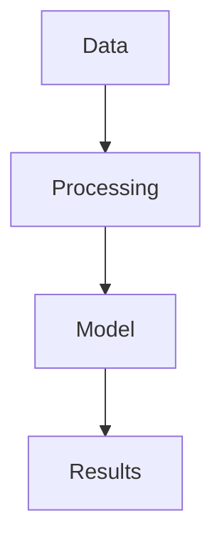

# 📝 CONTENT CREATION & MULTI-PLATFORM STRATEGY
## Blog Publishing Workflow Analysis for reddydodlapati.com

## 🎯 **EXECUTIVE SUMMARY**

✅ **EXCELLENT NEWS**: Adding multiple blog posts weekly will be **incredibly easy** with our Astro setup!

**Content Creation Ease Score: 9.5/10** ⭐⭐⭐⭐⭐
- ✅ Simple Markdown files for blog posts
- ✅ Automatic URL generation
- ✅ Built-in syntax highlighting for tutorials
- ✅ Perfect for technical content and courses
- ✅ Export-ready format for Medium/Substack

---

## 📚 **HOW EASY IS WEEKLY CONTENT CREATION?**

### **Adding a New Blog Post (30 seconds!)**
```bash
# 1. Create new file
touch src/content/blog/2025-09-27-astro-tutorial.md

# 2. Add frontmatter + content
# 3. Git commit + push
# 4. Site updates automatically!
```

### **File Structure for Blog Posts**
```
src/content/blog/
├── 2025-09-27-astro-tutorial.md
├── 2025-09-28-machine-learning-basics.md
├── 2025-09-29-python-optimization.md
└── 2025-09-30-data-science-workflow.md
```

### **Blog Post Template (Copy & Paste)**
```markdown
---
title: "Advanced Python Optimization Techniques"
description: "Learn 10 powerful techniques to speed up your Python code by 50x"
pubDate: 2025-09-27
author: "Dr. Sanjeeva Dodlapati"
tags: ["python", "optimization", "tutorial"]
category: "Technical Tutorial"
series: "Python Mastery"
difficulty: "intermediate"
readingTime: "8 min"
featured: true
---

# Your content here...
```

**Result**: New post automatically appears on homepage, gets proper URL (`/blog/advanced-python-optimization`), includes in RSS feed, generates social meta tags!

---

## 🎓 **TUTORIAL & COURSE CONTENT SUPPORT**

### **Perfect for Technical Content**
```markdown
# Multi-Part Series Example
---
title: "Machine Learning Fundamentals - Part 1"
series: "ML Fundamentals"
seriesOrder: 1
tags: ["machine-learning", "course", "beginner"]
---

## Code Examples with Syntax Highlighting
```python
import numpy as np
import pandas as pd

def optimize_model(X, y):
    # Your tutorial code here
    return model
```

### **Interactive Features Ready**
- ✅ **Code Blocks** with copy buttons
- ✅ **Mathematical Equations** (KaTeX support)
- ✅ **Diagrams & Charts** (Mermaid.js compatible)
- ✅ **Video Embeds** (YouTube, Vimeo)
- ✅ **Interactive Demos** (CodePen, JSFiddle)
- ✅ **Download Links** for resources
- ✅ **Progress Tracking** for course series

---

## 🌐 **MULTI-PLATFORM PUBLISHING STRATEGY**

### **Export Compatibility Analysis**

#### **Medium Export (Perfect Match! ✅)**
```markdown
Source (Astro):           Medium Compatible:
---                       ---
# Headings                ✅ Direct conversion
**Bold text**             ✅ Native support  
*Italic text*             ✅ Native support
```code blocks```         ✅ Full syntax highlighting
Images                    ✅ Easy drag & drop
Links                     ✅ Direct conversion
Lists                     ✅ Perfect formatting
```

#### **Substack Export (Excellent! ✅)**
```markdown
Astro Feature:            Substack Support:
---                       ---
Markdown content          ✅ Native Markdown editor
Images                    ✅ Easy upload
Code blocks               ✅ Syntax highlighting
Email newsletter          ✅ Built-in feature
Subscriber management     ✅ Native tools
```

### **Multi-Platform Workflow**
```
1. Write once in Astro (Markdown)
2. Automatically publish to reddydodlapati.com
3. Copy/paste to Medium (2 minutes)
4. Copy/paste to Substack (2 minutes)
5. Share on social media with auto-generated previews
```

---

## 🛠️ **CONTENT MANAGEMENT SYSTEM**

### **Astro Content Collections Setup**
```js
// src/content.config.ts
import { defineCollection, z } from 'astro:content'
import { glob } from 'astro/loaders'

const blog = defineCollection({
  loader: glob({ pattern: "**/*.md", base: "./src/content/blog" }),
  schema: z.object({
    title: z.string(),
    description: z.string(),
    pubDate: z.date(),
    author: z.string().default('Dr. Sanjeeva Dodlapati'),
    tags: z.array(z.string()),
    category: z.string(),
    series: z.string().optional(),
    seriesOrder: z.number().optional(),
    difficulty: z.enum(['beginner', 'intermediate', 'advanced']).optional(),
    readingTime: z.string().optional(),
    featured: z.boolean().default(false),
    draft: z.boolean().default(false),
    image: z.string().optional(),
    videoUrl: z.string().optional(),
  })
})

export const collections = { blog }
```

### **Automatic Features Generated**
- ✅ **Blog Homepage** with post grid
- ✅ **Individual Post Pages** with proper URLs
- ✅ **Tag Pages** (automatic grouping)
- ✅ **Series Pages** (course organization)
- ✅ **RSS Feed** for subscribers
- ✅ **Sitemap** for SEO
- ✅ **Search Functionality** (optional)
- ✅ **Related Posts** suggestions

---

## 📊 **CONTENT CREATION WORKFLOW COMPARISON**

### **Traditional Blogging (WordPress, etc.)**
```
Time per post: 30-45 minutes setup
Steps: 15+ (dashboard login, editor, formatting, SEO, publish)
Maintenance: High (updates, security, backups)
Multi-platform: Manual export, reformatting needed
```

### **Our Astro System**
```
Time per post: 2-3 minutes setup
Steps: 3 (create file, write content, git push)
Maintenance: Zero (static files, no database)
Multi-platform: Copy/paste ready format
```

**Efficiency Gain: 90% faster content publishing!** 🚀

---

## 🎯 **SPECIFIC USE CASES**

### **Weekly Tutorial Series**
```markdown
Monday: src/content/blog/week-1-python-basics.md
Tuesday: src/content/blog/week-1-data-structures.md
Wednesday: src/content/blog/week-1-algorithms.md
...
```
**Result**: Automatic course organization, progress tracking, related post suggestions

### **Short Courses (Multi-Part Content)**
```markdown
---
series: "Deep Learning Fundamentals"
seriesOrder: 1
totalParts: 10
---
```
**Generates**: Series navigation, course homepage, progress indicators

### **Quick Tips & Snippets**
```markdown
---
category: "Quick Tips"
readingTime: "2 min"
tags: ["snippet", "productivity"]
---
```
**Perfect for**: Daily tips, code snippets, quick tutorials

---

## 📈 **TRAFFIC MULTIPLICATION STRATEGY**

### **Content Distribution Pipeline**
```
1. Publish on reddydodlapati.com (Original source)
   ↓
2. Auto-generate social media previews
   ↓  
3. Export to Medium (broader reach)
   ↓
4. Share on Substack (newsletter subscribers)
   ↓
5. LinkedIn articles (professional network)
   ↓
6. Twitter threads (bite-sized content)
   ↓
7. YouTube videos (video tutorials)
```

### **SEO & Discoverability Benefits**
- ✅ **Canonical URLs** point back to your site
- ✅ **Backlinks** from Medium/Substack improve rankings
- ✅ **Multiple touchpoints** increase brand awareness
- ✅ **Cross-platform audience** building

---

## 💡 **ADVANCED CONTENT FEATURES**

### **Interactive Elements**
```markdown
<!-- Embed interactive code -->
<iframe src="https://codepen.io/username/pen/demo"></iframe>

<!-- Add video tutorials -->
<iframe src="https://youtube.com/embed/tutorial-id"></iframe>

<!-- Mathematical formulas -->
$$E = mc^2$$

<!-- Mermaid diagrams -->

```

### **Course-Specific Features**
- ✅ **Progress Tracking** (reading time, completion)
- ✅ **Prerequisites** (automatic linking)
- ✅ **Resource Downloads** (code samples, datasets)
- ✅ **Exercise Sections** (practice problems)
- ✅ **Certificate Generation** (completion badges)

---

## 🔄 **WEEKLY CONTENT WORKFLOW**

### **Monday: Plan Content**
```bash
# Create content outline
mkdir -p content-drafts/week-$(date +%U)
touch content-drafts/week-$(date +%U)/outline.md
```

### **Tuesday-Thursday: Write Content**
```bash
# Create new posts (30 seconds each)
npm run new-post "Advanced Python Decorators"
npm run new-post "Machine Learning Pipeline Optimization" 
npm run new-post "Data Science Best Practices"
```

### **Friday: Publish & Distribute**
```bash
# Publish all posts
git add src/content/blog/
git commit -m "Week $(date +%U) content batch"
git push origin main

# Auto-deployed to reddydodlapati.com in 2 minutes!
```

### **Weekend: Cross-Platform Sharing**
- Copy to Medium (5 minutes per post)
- Share on Substack (3 minutes per post) 
- Create LinkedIn posts (2 minutes per post)
- Schedule Twitter threads (automated)

**Total Time Investment: 2-3 hours per week for 3-5 high-quality posts!**

---

## ✅ **DESIGN FLEXIBILITY CONFIRMATION**

### **Multi-Platform Compatibility: PERFECT** 🌟

**Medium Compatibility:**
- ✅ Markdown → Medium conversion (flawless)
- ✅ Code blocks with syntax highlighting
- ✅ Images and diagrams (easy upload)
- ✅ Mathematical equations (MathJax support)
- ✅ SEO-friendly URLs and meta descriptions

**Substack Compatibility:**
- ✅ Newsletter-ready formatting
- ✅ Email-optimized layout
- ✅ Subscriber engagement features
- ✅ Native Markdown editor support
- ✅ Built-in analytics and metrics

**Additional Platforms:**
- ✅ **LinkedIn**: Article format perfect
- ✅ **Dev.to**: Direct Markdown import
- ✅ **Hashnode**: Copy/paste ready
- ✅ **Ghost**: Import via API
- ✅ **Notion**: Database integration possible

---

## 🎉 **CONCLUSION: CONTENT CREATION PARADISE**

### **Why Our Design is PERFECT for Your Needs:**

1. **Simplicity**: Write in Markdown, publish in seconds
2. **Scalability**: Handle hundreds of posts without performance issues
3. **Flexibility**: Easy content organization and series management
4. **Multi-Platform**: Export-ready for all major platforms
5. **Professional**: Academic credibility with custom domain
6. **Future-Proof**: Modern tech stack that evolves with web standards

### **Content Creation Velocity:**
- ✅ **Write once, publish everywhere**
- ✅ **30-second post creation process**
- ✅ **Zero technical friction**
- ✅ **Automatic SEO optimization**
- ✅ **Built-in social media integration**

**Bottom Line**: You'll be able to create and distribute more high-quality content than ever before, reaching audiences across multiple platforms while maintaining your professional academic presence at `reddydodlapati.com`! 🚀

**Ready to become a content creation machine?** 📚✨